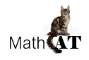

# MathCATde: German Translation for MathCAT: Math Capable Assistive Technology

is a library that supports conversion of MathML to:

* Speech strings (in several languages) with embedded speech engine commands
* (later: Braille (Nemeth, UEB Technical, CMU, and many others))
* Navigation of math (in multiple ways including overviews)

This is the fork of [MathCAT](https://github.com/NSoiffer/MathCAT) of Neil Soiffer focussed on the translations to the German speaking contexts. 

## Status
This translation project was launched in the summer 2025 it is quite new still.

## How to contribute?
This project is untertaken by the team of IT&Tech at the [IU University of Applied Sciences](https://www.iu.org/) and welcomes test-reports in the form of issues and proposed changes in the form of pull-requests.

For process questions, raising an issue is probably the best idea too.